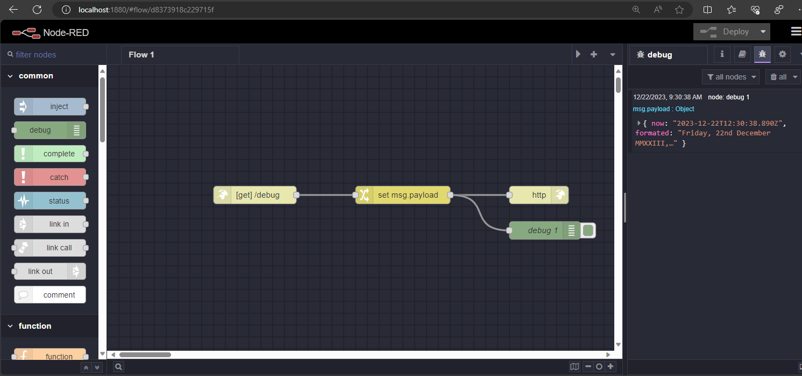

# Local Environment for NODERED development

## Dependencies

To set up a local development environment for NodeRED, ensure you have the following dependencies installed:

- VSCode Remote Development - https://code.visualstudio.com/docs/remote/remote-overview
- Docker or Containerd or Podman
- VSCode Remote Container - https://marketplace.visualstudio.com/items?itemName=ms-vscode-remote.remote-containers

## Getting Started

1. Start VSCode with the Remote Development extension.
2. Open the project in a Dev Container using VSCode Remote Containers.
3. The NodeRED Editor UI will be accessible at: http://localhost:1880/




## Test Flow

Run a test flow request using the following command:

```bash
curl http://localhost:1880/debug
{"now":"2023-12-22T12:34:10.947Z","formated":"Friday, 22nd December MMXXIII, 12:34pm"}
```
 
## Environment Variables:

Configure your environment using the following variables:

| key            | default value | description             |
| -------------- | ------------- | ----------------------- |
| EDITOR_ENABLED | false         | Enable Editor UI        |
| EDITOR_THEME   | default       | [theme-collection](https://github.com/node-red-contrib-themes/theme-collection/tree/screenshots)        |
| PORT           | 1880          | Default Http Port       |
| LOG_LEVEL      | info          | [Log Level](#log-level) |

## Build a docker file 

To build a Docker image, use the following command:

`docker build . -t <tag value>` 

The default configuration for the Docker image has `EDITOR_ENABLED` set to false, and it uses the Minimal image for the NodeRED runtime.

### Log Level:
Specify the log level using one of the following options:
* fatal - only those errors which make the application unusable should be recorded
* error - record errors which are deemed fatal for a particular request + fatal errors
* warn - record problems which are non fatal + errors + fatal errors
* info - record information about the general running of the application + warn + error + fatal errors
* debug - record information which is more verbose than info + info + warn + error + fatal errors
* trace - record very detailed logging + debug + info + warn + error + fatal errors
* off - turn off all logging (doesn't affect metrics or audit)